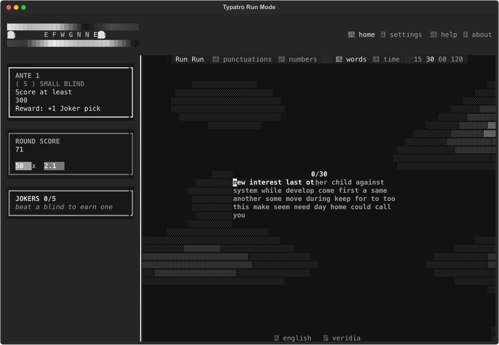
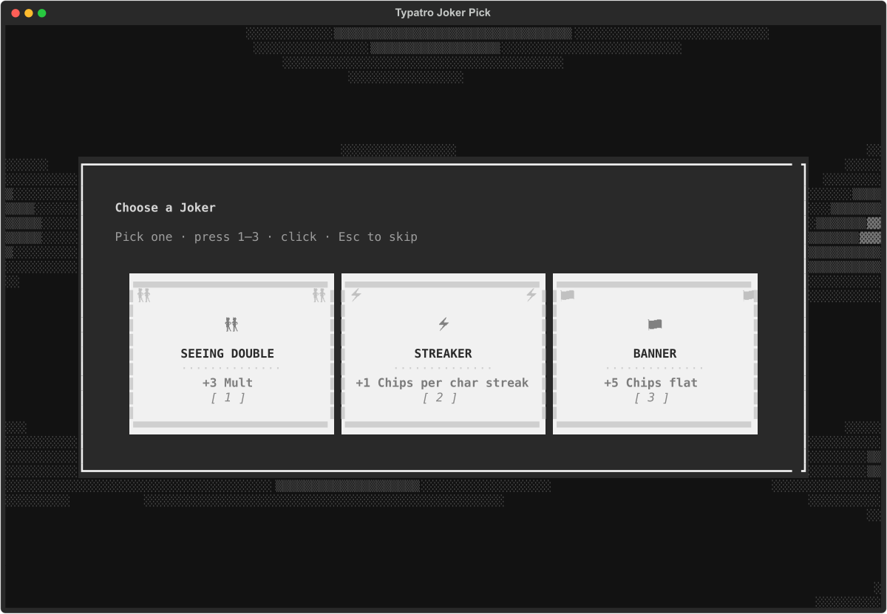
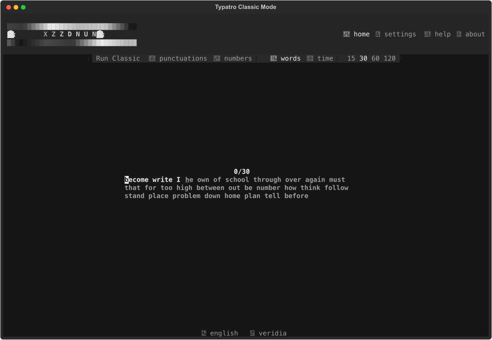
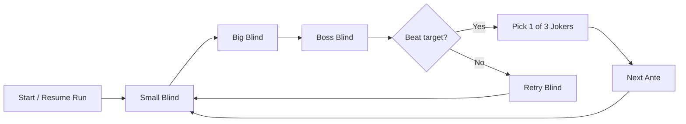

# TYPATRO

**A slot-machine typing roguelike for your terminal.** Type fast, stack **Chips × Mult**, beat Blinds, collect Jokers, and climb endless Antes — all in a casino-felt TUI with reel-spin animations and a plasma shader backdrop.

[](https://pypi.org/project/typatro/)
[](https://pypi.org/project/typatro/)
[](https://www.gnu.org/licenses/gpl-3.0)
[](https://github.com/Swayyum/Typatro/actions/workflows/publish-pypi.yml)

## Install

Requires Python 3.9+.

```bash
pip install typatro
typatro
```

A [Nerd Font](https://www.nerdfonts.com/) improves suit icons and UI glyphs but is not required.


## Screenshots

| Run mode | Joker pick | Classic mode |
|:---:|:---:|:---:|
|  |  |  |
| Blind ladder, Chips × Mult odometer, plasma backdrop | Beat a blind, choose a power-up | Plain practice when you just want to type |

## Features

| | |
|---|---|
| **Chips × Mult scoring** | +1 chip per correct character, +10 per word; mult scales with accuracy and error-free streaks |
| **Blind ladder** | Small → Big → Boss each ante; score targets scale exponentially as you climb |
| **10 boss blinds** | Rotating bosses with distinct debuffs — hidden mistakes, speed floors, no backspace, forced accuracy, and more |
| **26 jokers** | Beat a blind, pick 1 of 3; hold up to 5 jokers that modify chips, mult, streaks, and word bonuses |
| **Endless antes** | Run state persists between sessions; lose a blind and retry, or reset from Settings |
| **Classic mode** | Plain typing test when you just want to practice — no blinds, no jokers |
| **170+ themes** | Full Textual theme library plus a dedicated Balatro palette; switch live with `Ctrl+T` |
| **Terminal shader** | Cached plasma-metaball backdrop behind the felt panel — pauses while you type for smooth input |
| **Slot machine feel** | Reel-spin title intro, odometer score tally, digit-spin result reveals |

## Play

```bash
typatro            # run mode (default)
typatro --classic  # plain typing test
```

### Controls

| Key | Action |
|-----|--------|
| Type | Start the test |
| Tab | Reset test |
| Esc | New paragraph |
| Ctrl+S | Settings |
| Ctrl+T | Themes |
| Ctrl+L | Languages |

Click **Run / Classic** in the strip above the typing area to switch modes.

## How a run works



1. The sidebar shows your current **Blind** and its score target.
2. Type the paragraph — the **Round Score** odometer rolls up with every keystroke.
3. Hit the target before the test ends to beat the blind.
4. Pick a **Joker** and advance; bosses add debuffs and bigger targets.
5. Lose a blind? Retry it. Want a fresh start? **Settings → Danger Zone → Reset Run**.

## Content at a glance

| Category | Count | Notes |
|----------|------:|-------|
| Boss blinds | 10 | Rotates by ante — The Hook, The Wall, The Needle, The Eye, The Psychic, The Ox, The Manacle, The Water, The Window, The Goad |
| Jokers | 26 | Flat mult, per-word chips, streak bonuses, accuracy scaling, punctuation/digit rewards, and more |
| Themes | 170+ | Includes `balatro`, `terminal`, `dracula`, `nord`, and the full Monkeytype-derived palette |
| Game modes | 2 | **Run** (roguelike) and **Classic** (practice) |

## Contributing

Bug reports, feature ideas, themes, and pull requests are welcome. See **[CONTRIBUTING.md](CONTRIBUTING.md)** for local setup, coding conventions, and release notes for maintainers.

## Credits & license

Copyright © 2026 [Swayyum](https://github.com/Swayyum). TYPATRO is licensed under [GPL-3.0-only](LICENSE).

Inspired by [Balatro](https://www.playbalatro.com/) and the terminal typing-test tradition. Not affiliated with either.
